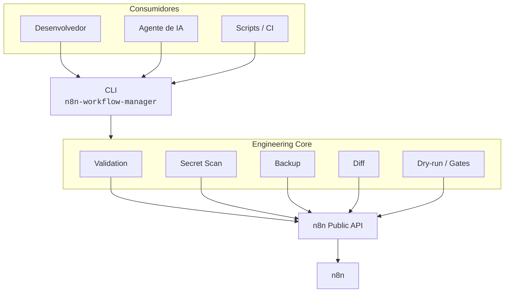
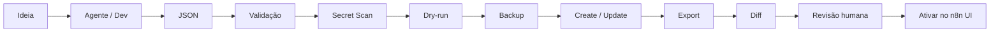

<div align="center">

# ⚙️ n8n AI Workflow Engineering

### Engenharia segura de workflows n8n para humanos e agentes de IA

**Workflow-as-Code** com validação, dry-run, backup, diff e gates de segurança —
entre o agente e a [n8n Public API](https://docs.n8n.io/api/).

<br />

[](LICENSE)
[](pyproject.toml)
[](https://docs.n8n.io/api/)
[](#)
[](docs/AI-AGENTS.md)
[](https://github.com/VinyChagas/n8n-ai-workflow-engineering)

<br />

> **Agentes de IA podem propor workflows.**
> **Este projeto garante que eles avancem como engenheiros — com validação, dry-run e autorização humana.**

<br />

[Começando](#-começando) ·
[Arquitetura](#️-arquitetura) ·
[Segurança](#️-segurança-por-padrão) ·
[CLI](#-primeiro-uso) ·
[Roadmap](#️-roadmap) ·
[Docs](#-documentação)

</div>

---

## 💡 Por que este projeto existe?

Ferramentas como **Cursor**, **Claude Code**, **OpenAI Codex**, **Gemini** e outros agentes conseguem gerar JSON e chamar APIs com facilidade.

Mas **gerar um workflow não é o mesmo que engenharia segura**.

Entre *"gere um workflow"* e *"publique isso em uma instância real"* existem riscos concretos:

| Risco | Impacto |
|-------|---------|
| JSON inválido ou estrutura quebrada | Falha silenciosa ou comportamento inesperado |
| Secrets embutidos no source | Vazamento no Git e em logs |
| Alteração de workflow **ativo** | Automação de produção muda sem revisão |
| Ausência de backup / diff | Sem rollback e sem auditoria |
| Escrita imediata na API | Sem dry-run, sem plano, sem aprovação |

**n8n AI Workflow Engineering** atua exatamente nessa camada intermediária:

```text
Agente / desenvolvedor  →  CLI  →  Engineering Core  →  n8n Public API  →  n8n
```

O objetivo **não** é “dar controle total do n8n à IA”.
O objetivo é permitir **Workflow-as-Code** com validação, dry-run, backup, diff, proteção contra operações perigosas e revisão humana.

Este projeto nasceu da engenharia de um ambiente real self-hosted, onde agentes de IA foram usados para projetar, validar, testar e implantar workflows n8n em produção — com gates de segurança.

---

## 🏗️ Arquitetura



| Camada | Papel |
|--------|--------|
| **Consumidores** | Humanos, Cursor, Claude Code, Codex, Gemini, scripts — qualquer cliente capaz de editar arquivos e executar shell |
| **CLI** | Interface única da V0.1 (`bin/n8n-workflow-manager`) |
| **Engineering Core** | Validação, secret scan, backup, diff, dry-run e gates (`--apply`, `--allow-active-update`) |
| **n8n Public API** | Contrato oficial de leitura/escrita de workflows |
| **n8n** | Runtime das automações |

O **Core não depende** de Cursor, Claude Code, Codex ou Gemini.
Esses agentes são apenas consumidores possíveis.

Superfícies futuras (MCP, REST, Web UI) devem reutilizar o mesmo Core — ver [docs/MCP-ROADMAP.md](docs/MCP-ROADMAP.md).

---

## 🛡️ Segurança por padrão

A V0.1 prioriza **segurança operacional** sobre conveniência.

| Princípio | Comportamento |
|-----------|----------------|
| Dry-run por padrão | `create` e `update` **não escrevem** no n8n sem `--apply` |
| Escrita explícita | `--apply` é obrigatório para mutação real |
| Proteção de workflow ativo | Update de workflow ativo é **recusado**, salvo `--allow-active-update` |
| Secret scan | Tokens, JWTs, chaves privadas e Bearers inline são bloqueados |
| Backup local | Snapshots em `BACKUP_DIRECTORY` antes do plano (inclusive no dry-run) |
| Diff | Comparação normalizada entre local e remoto |
| Credenciais | Apenas referências `id` / `name` — nunca `data` |
| API key | Arquivo local (`N8N_API_KEY_FILE`), fora do Git |
| Create inativo | Workflows novos devem permanecer **inactive** |

### Propositalmente **não** implementado

| Comando | Motivo |
|---------|--------|
| `delete` | Evitar destruição acidental por agentes |
| `activate` / `deactivate` | Ativação permanece decisão humana (UI / processo auditado) |
| `execute` | Sem disparo remoto de execuções via esta CLI |
| `publish` | Fora do escopo da V0.1 |

> Isso é **decisão de segurança**, não limitação acidental.

Escopos de API key recomendados: `workflow:list`, `workflow:read`, `workflow:create`, `workflow:update`.
Prefira **não** conceder activate / delete / execute a agentes.

Detalhes: [SECURITY.md](SECURITY.md) · [docs/SECURITY.md](docs/SECURITY.md)

---

## ✨ Funcionalidades

| Recurso | Estado |
|---------|--------|
| Listar workflows (`list`) | ✅ V0.1 |
| Status local + remoto (`status`) | ✅ V0.1 |
| Exportar workflow (`export`) | ✅ V0.1 |
| Exportar todos (`export-all`) | ✅ V0.1 |
| Validar workflow (`validate`) | ✅ V0.1 |
| Detectar secrets | ✅ V0.1 |
| Diff local / remoto (`diff`) | ✅ V0.1 |
| Backup (`backup`) | ✅ V0.1 |
| Dry-run create | ✅ V0.1 |
| Create com `--apply` | ✅ V0.1 |
| Dry-run update | ✅ V0.1 |
| Update com `--apply` | ✅ V0.1 |
| Proteção de workflow ativo | ✅ V0.1 |
| MCP | 🗺️ Roadmap |
| REST API própria | 🗺️ Futuro |
| Web UI | 🗺️ Futuro |

---

## 🚀 Começando

### Requisitos

- Python **3.10+**
- Instância n8n acessível
- API key em arquivo (uma linha, sem aspas)

### Instalação

```bash
git clone https://github.com/VinyChagas/n8n-ai-workflow-engineering.git
cd n8n-ai-workflow-engineering

python3 -m venv .venv
source .venv/bin/activate   # Windows: .venv\Scripts\activate

pip install -e .
```

Você também pode usar o launcher sem instalar globalmente:

```bash
./bin/n8n-workflow-manager --help
```

### Configuração

```bash
cp .env.example .env
mkdir -p .secrets
# escreva a API key (uma linha) em .secrets/n8n-api-key
chmod 600 .secrets/n8n-api-key
```

| Variável | Função | Padrão |
|----------|--------|--------|
| `N8N_BASE_URL` | URL da instância n8n | `http://localhost:5678` |
| `N8N_API_BASE` | Base completa `/api/v1` (opcional) | derivada de `N8N_BASE_URL` |
| `N8N_API_KEY_FILE` | Caminho do arquivo da API key | `.secrets/n8n-api-key` |
| `WORKFLOW_DIRECTORY` | JSON local (source of truth) | `./workflows` |
| `BACKUP_DIRECTORY` | Snapshots timestampados | `./backups/git-backups` |
| `TEMPLATES_DIRECTORY` | Templates | `./templates` |

Referência completa: [.env.example](.env.example)

---

## ▶️ Primeiro uso

```bash
# Ajuda
n8n-workflow-manager --help
# ou: ./bin/n8n-workflow-manager --help

# Status da configuração e resumo remoto
n8n-workflow-manager status

# Listar workflows remotos
n8n-workflow-manager list

# Validar um exemplo (sem chamar a API)
n8n-workflow-manager validate workflows/examples/hello-world.json --offline

# Plano de criação (dry-run — NÃO escreve no n8n)
n8n-workflow-manager dry-run-create workflows/examples/hello-world.json

# Criar de fato (somente após revisar o plano)
n8n-workflow-manager create workflows/examples/hello-world.json --apply

# Exportar e comparar
n8n-workflow-manager export "Hello World"
n8n-workflow-manager diff "Hello World"
```

### Atualização (mesmo modelo de segurança)

```bash
n8n-workflow-manager dry-run-update "Hello World" caminho/do/arquivo.json
n8n-workflow-manager update "Hello World" caminho/do/arquivo.json --apply
```

> Workflow **ativo**: o update é recusado, salvo `--allow-active-update` com autorização explícita.

### Exemplos incluídos

| Arquivo | Descrição |
|---------|-----------|
| [`workflows/examples/hello-world.json`](workflows/examples/hello-world.json) | Manual Trigger → Set |
| [`workflows/examples/health-monitor.json`](workflows/examples/health-monitor.json) | Schedule → Set (placeholder) |
| [`templates/minimal-manual.json`](templates/minimal-manual.json) | Esqueleto reutilizável |

---

## 🔄 Ciclo de vida de um workflow



O humano permanece no controle.
A CLI **não ativa** workflows na V0.1 — a ativação fica para a UI do n8n (ou processo auditado futuro).

Detalhes: [docs/WORKFLOW-LIFECYCLE.md](docs/WORKFLOW-LIFECYCLE.md)

---

## 🤖 Usando com agentes de IA

O projeto é **agent-agnostic**.

Qualquer agente (ou humano) que consiga:

1. editar arquivos JSON
2. executar comandos no shell
3. ler a saída

pode operar este repositório.

```text
Cursor / Claude Code / Codex / Gemini / outro
                    ↓
                   CLI
                    ↓
            Engineering Core
                    ↓
              n8n Public API
```

Prompts de exemplo:

- [examples/prompts/cursor.md](examples/prompts/cursor.md)
- [examples/prompts/claude-code.md](examples/prompts/claude-code.md)
- [examples/prompts/codex.md](examples/prompts/codex.md)

Guia: [docs/AI-AGENTS.md](docs/AI-AGENTS.md)

---

## 🧩 Exemplo conceitual

**Usuário:**
*"Crie um workflow que monitore a saúde da minha aplicação."*

**Agente externo** (Cursor, Claude Code, etc.):

1. Gera o JSON do workflow
2. `validate … --offline`
3. `dry-run-create …`
4. Mostra o plano / riscos
5. Aguarda aprovação humana
6. Só então: `create … --apply`
7. `export` + `diff` para conferência

> O Core **não** interpreta linguagem natural.
> O agente externo faz essa parte; o Engineering Core valida e aplica gates.

---

## 📁 Estrutura do projeto

```text
n8n-ai-workflow-engineering/
├── bin/                 # CLI (n8n-workflow-manager)
├── src/                 # Engineering Core (api, validation, deployment, config)
├── tests/               # Testes unitários + integração opcional
├── workflows/examples/  # Exemplos genéricos de workflow
├── templates/           # Esqueletos reutilizáveis
├── examples/prompts/    # Prompts para agentes de IA
├── docs/                # Documentação aprofundada
├── .env.example         # Template de configuração
└── LICENSE              # Apache License 2.0
```

---

## 🗺️ Roadmap

### Disponível na V0.1

- CLI completa para list / export / validate / diff / backup
- Create e update com dry-run e `--apply`
- Secret scan e proteções de escrita
- Engineering Core importável (Python)
- Exemplos, templates e prompts para agentes

### Futuro (conceitual)

| Item | Status |
|------|--------|
| Servidor **MCP** expondo as mesmas operações | Roadmap |
| REST API própria sobre o Core | Futuro |
| Web UI de revisão / aprovação | Futuro |
| Fluxos de approval mais ricos | Futuro |
| Observabilidade / inspeção de execuções (read-only) | Futuro |
| Multi-instance / environments | Futuro |
| RBAC dedicado | Futuro |

Ver: [docs/MCP-ROADMAP.md](docs/MCP-ROADMAP.md)

---

## 🧠 Filosofia do projeto

> **Primeiro** usamos ferramentas de engenharia para descobrir, construir e validar a arquitetura.
> **Depois** transformamos operações comprovadamente seguras em interfaces padronizadas para agentes.

<div align="center">

### IA propõe. · Engineering Core valida. · Humano autoriza. · n8n executa.

</div>

---

## 📚 Documentação

| Documento | Conteúdo |
|-----------|----------|
| [docs/ARCHITECTURE.md](docs/ARCHITECTURE.md) | Camadas e contratos |
| [docs/WORKFLOW-LIFECYCLE.md](docs/WORKFLOW-LIFECYCLE.md) | Do requisito à ativação |
| [docs/SECURITY.md](docs/SECURITY.md) | Modelo de ameaças e mitigações |
| [docs/AI-AGENTS.md](docs/AI-AGENTS.md) | Uso por agentes |
| [docs/API.md](docs/API.md) | CLI e superfície do Core |
| [docs/MCP-ROADMAP.md](docs/MCP-ROADMAP.md) | MCP / superfícies futuras |
| [CONTRIBUTING.md](CONTRIBUTING.md) | Como contribuir |
| [SECURITY.md](SECURITY.md) | Política de segurança / disclosure |

---

## 🧪 Testes

```bash
./bin/run-tests
# equivalente:
python3 -m unittest discover -s tests/validation -v
```

Testes de integração contra n8n real ficam desabilitados por padrão.
Ative apenas com `N8N_INTEGRATION=1` e configuração local adequada.

---

## 🤝 Contribuindo

Contribuições são bem-vindas: issues, discussões e pull requests.

Leia [CONTRIBUTING.md](CONTRIBUTING.md) antes de abrir um PR.
Para vulnerabilidades, use [SECURITY.md](SECURITY.md) — não abra issue pública com exploits ou secrets.

---

## 📄 Licença

Este projeto é distribuído sob a **[Apache License 2.0](LICENSE)** (`SPDX: Apache-2.0`).

Você pode usar, modificar e distribuir o software conforme os termos da licença, inclusive em contextos comerciais, desde que respeite as obrigações de atribuição e NOTICE quando aplicável.

---

## 👨‍💻 Autor

**Vinicius Chagas**
GitHub: [@VinyChagas](https://github.com/VinyChagas)

---

<div align="center">

**n8n AI Workflow Engineering** — V0.1
*Workflow-as-Code com gates de segurança para humanos e agentes de IA.*

</div>
